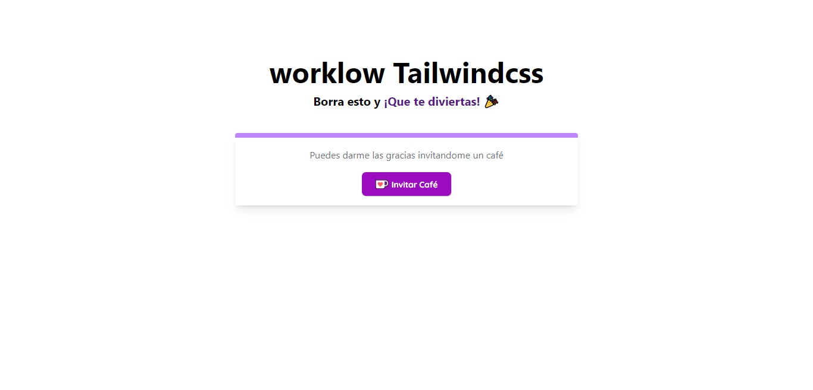

<h2 align="center">Workflow para Tailwind</h2>

 

### workflow para crear plantillas html con tailwind

Este workflow que es muy útil incluye 👇

* "autoprefixer": "^10.4.7"
* "cssnano": "^5.1.12"
* "gulp": "^4.0.2"
* "gulp-avif": "^1.1.1"
* "gulp-cache": "^1.1.3"
* "gulp-imagemin": "^7.1.0"
* "gulp-postcss": "^9.0.1"
* "gulp-terser-js": "^5.2.2"
* "gulp-webp": "^4.0.1"
* "postcss-cli": "^9.1.0"
* "tailwindcss": "^3.1.4"

### ¿Cómo empezar?

1. Clonar este repositorio
2. `npm install` para instalar las dependencias requeridas
3. Personaliza `tailwind.config.js` archivo de configuración (¡solo si es necesario!)
4. `gulp dev` para iniciar el servidor de desarrollo
5. ¡Abre `index.html` con la extensión Live Server de vscode!

Si realiza cambios en la configuración de Tailwind, es posible que deba detener y reiniciar el servidor de sincronización del navegador para que se apliquen los cambios.

**Que te diviertas** 🎉
